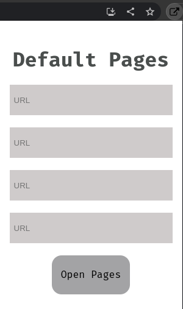

  

<h1 align="center">Default Pages 2.0</h1>

Extension that opens default pages

# Functionalities

- Open established pages ✔️ 
- User choose pages ✔️
 
 

## Show your support!

Help the project with a ⭐️

